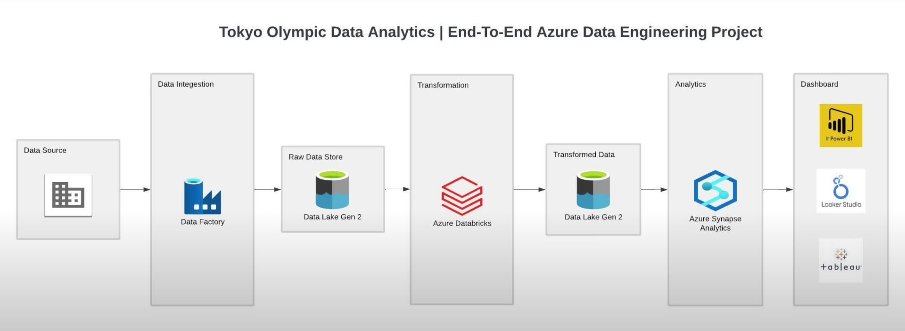

# Olympic Data Analytics using Microsoft Azure
## Introduction 
Optimized data ingestion and transformation processes using Azure Data Factory, Azure Databricks, and Spark, resulting in efficient data loading into Azure Data Lake Storage and enabling large-scale data transformations.

Enhanced data analysis and visualization capabilities through Azure Synapse Analytics, supporting SQL queries on transformed data and delivering insightful visualizations with Tableau.

## Architecture

## Technology Used
Programming Language: Python
- Microsoft Azure 
1. Azure Data Factory
2. Azure Data Lake
3. Azure Databricks
4. Azure Synapse
- Tableau

